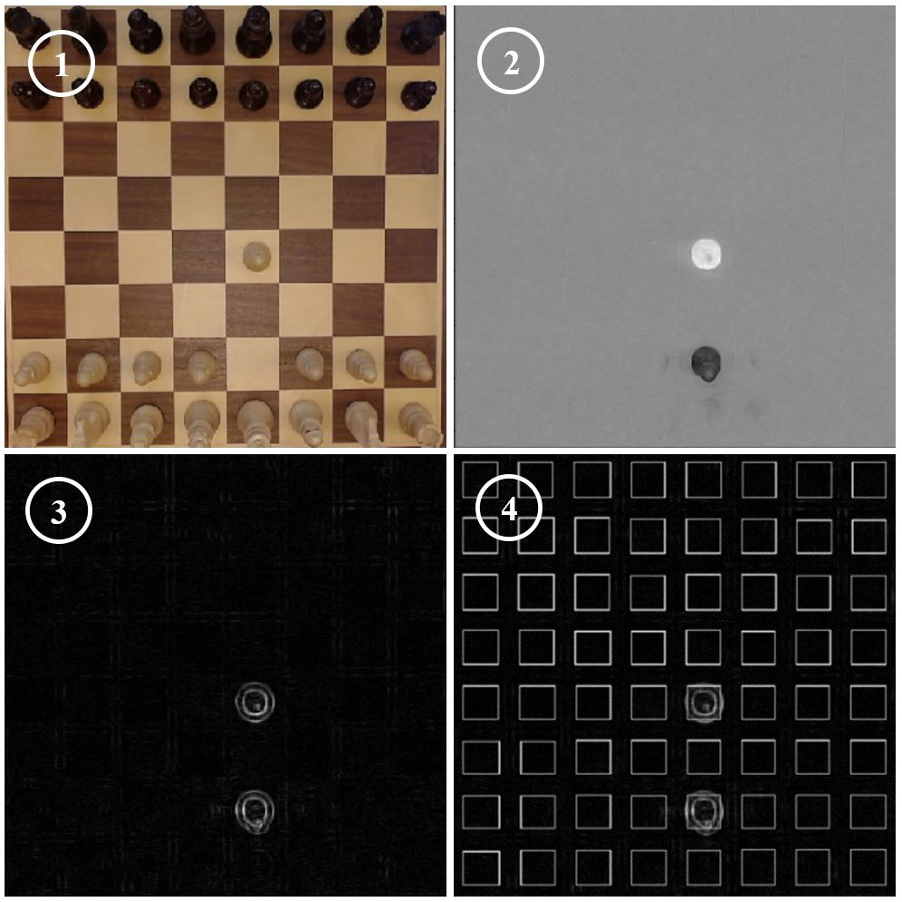

# Chess-Playing Robot

A robotic chess system that enables a **Franka Emika Panda** robot arm to play chess against a human using a standard webcam and computer vision.

The system combines **computer vision, robotic motion planning, ROS 1, MoveIt, and the Lichess API** to create an interactive physical chessboard where human moves are detected automatically and the robot responds by physically moving the appropriate pieces.

## Demo

<video
src="media/demo.mp4"
controls
width="100%"> 
</video>

## Overview

This project enables a Franka Panda robot to play complete chess games against a human on a physical chessboard. The system uses a webcam to continuously observe the board and determines the human player's moves entirely through **computer vision**.

A key feature of the system is that it does **not require a specific chessboard or specially marked pieces**. Instead, the vision pipeline analyzes the appearance and state of the board to determine which squares have changed, allowing the application to work with a wide variety of physical chessboards.

Once a human move is detected, it is sent to **Lichess**, where the game is managed and the robot's opponent can be either a chess engine or another human player.

The robot then receives the opponent's move from Lichess and uses ROS and MoveIt to plan and execute the corresponding motion on the physical chessboard.

## Key Features

* ♟️ **Autonomous physical chess gameplay** with a Franka Panda robot arm
* 📷 **Computer-vision-based move detection** using a standard webcam
* ♟️ Works with **almost any physical chessboard** without requiring specialized hardware
* 🤖 Robot motion planning and execution using **ROS 1 and MoveIt Commander**
* 🌐 Integration with the **Lichess API** for online chess games
* 🧠 Play against **Lichess chess engines at different difficulty levels**
* 👤 Play against **another human remotely through Lichess**
* 🐍 Entire application implemented in **Python 2.7**

## How It Works

The application creates a bridge between a physical chessboard, the robot, and Lichess.

### Human vs. Robot

1. The webcam captures the physical chessboard.
2. The computer-vision pipeline detects the human's move.
3. The detected move is sent to Lichess.
4. Lichess provides the opponent's response.
5. The robot plans the required motion using MoveIt.
6. The Panda physically executes the move on the chessboard.
7. The process repeats until the game ends.

### Remote Human vs. Human

The same system can also be used to play against another person remotely.

A human makes a move on the physical chessboard, which is detected by the camera and sent to Lichess. The opponent receives the move on their own device and responds through Lichess. That move is then streamed back to the robot, which physically performs it on the chessboard.

This effectively allows the robot to act as a **physical interface to an online Lichess game**.

```text
Physical Chessboard
        │
        ▼
     Webcam
        │
        ▼
Computer Vision
        │
        ▼
   Detected Move
        │
        ▼
   Lichess API
        │
   ┌────┴────┐
   ▼         ▼
Chess      Human
Engine    Opponent
   │         │
   └────┬────┘
        ▼
 Opponent's Move
        │
        ▼
    MoveIt / ROS
        │
        ▼
 Franka Panda Robot
        │
        ▼
Physical Chessboard
```

## Computer Vision Pipeline

The system uses a four-step computer vision pipeline to determine how the physical chessboard has changed between moves.



1. **[Image Rectification]**
   The captured chessboard is aligned in the camera's view to ensure consistent image processing.

2. **[Difference Calculation]**
   The newly captured image is subtracted from the previously captured image, before the move was made, to identify changes.

3. **[Noise Reduction]**
   A Laplacian operator is applied to minimize noise and enhance significant changes.

4. **[Mean Value Analysis]**
   The mean value of the inner pixels of each square is calculated to detect moved pieces.


For detecting special moves such as castling and en passant, the program uses internal board tracking which tracks which squares were occupied by black and which by white pieces before the move was made. The program then combines this information with data from the computer vision subprogram to not only correctly identify special moves but also to detect normal moves with higher accuracy.


## Technologies

| Technology             | Purpose                                                         |
| ---------------------- | --------------------------------------------------------------- |
| **Python 2.7**             | Main programming language                                   |
| **ROS 1**              | Robot communication and control framework                       |
| **MoveIt Commander**   | Robot motion planning and execution                             |
| **Franka Emika Panda** | Robotic manipulator                                             |
| **Computer Vision**    | Chessboard and move detection                                   |
| **Webcam**             | Visual input                                                    |
| **Lichess API**        | Online chess game management and real-time move synchronization |


